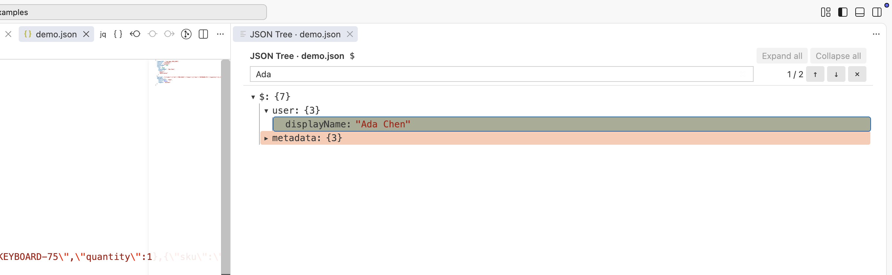
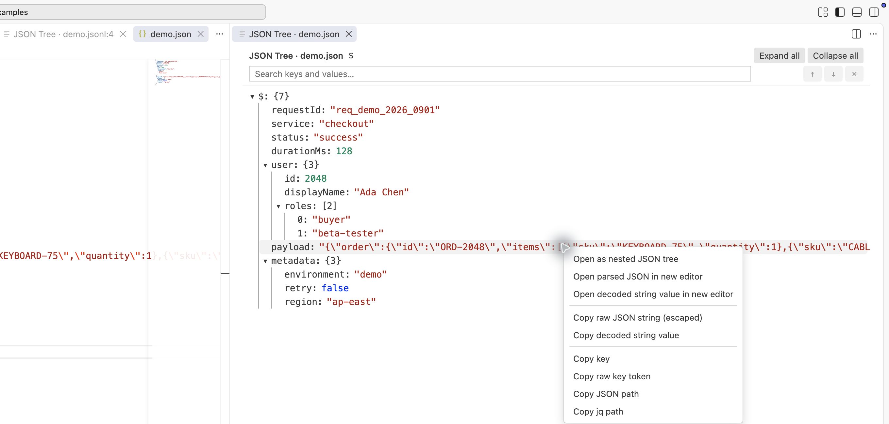
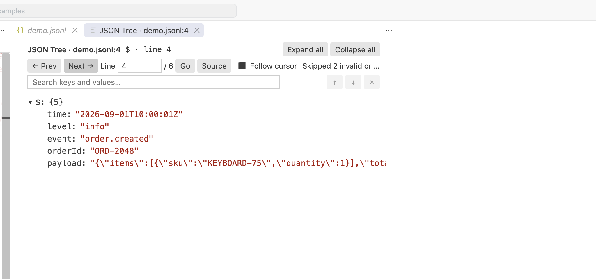

# Nested JSON Tree

<p align="center">
  
</p>

<p align="center">
  Inspect JSON, JSONL, log-embedded JSON, and escaped nested JSON as an interactive tree in VS Code.
</p>

<p align="center">
  <a href="README.zh-CN.md">简体中文</a> ·
  <a href="https://github.com/stevelee477/nested-json-tree/actions/workflows/ci.yml"></a> ·
  <a href="LICENSE"></a>
</p>

Nested JSON Tree is a read-only viewer for the JSON that ordinary formatters struggle with: JSON hidden inside log lines, one record in a JSONL file, or an escaped JSON string nested several levels deep.

<a href="assets/screenshots/tree-search.png"></a>

## Highlights

- Open a JSON/JSONC document as a collapsible tree.
- Accept JSONC line/block comments and trailing commas.
- Extract valid JSON even when unrelated text appears before or after it.
- Navigate valid JSONL/NDJSON records in one Tree View without loading the whole document into the parser.
- Right-click a string and recursively open escaped or double-encoded JSON.
- Decode, parse, format, and open nested JSON in a normal untitled editor.
- Open any decoded string as plain text, preserving real newlines and other decoded characters without requiring JSON.
- Preserve large integers and original tokens such as `"\u0061"` and `"\/"` in display, search, copy, and formatting.
- Search decoded and raw keys/values incrementally, filter unrelated branches, and navigate results.
- Copy lossless values, decoded strings, exact escaped string literals, JSONPath, and jq filters.
- Choose between multiple detected JSON candidates.
- Automatically expand small trees; keep large trees manageable.

## Nested JSON

Right-click any string node to open JSON encoded inside it. The new tree supports the same actions, so nesting can be explored repeatedly.

<a href="assets/screenshots/nested-json-menu.png"></a>

Choose **Open parsed JSON in new editor** to decode and format the value as a normal JSON document, or **Open decoded string value in new editor** to open the decoded text unchanged in a plain-text editor.

## JSONL / NDJSON

Place the cursor on a record and select **Nested JSON Tree: Open Current Line as Tree** from the editor context menu or Command Palette.

<a href="assets/screenshots/jsonl-current-line.png"></a>

The Tree View keeps the source URI and current line. Use **Prev**, **Next**, or a line number to jump between valid records in the same tab; empty, invalid, and resource-limited lines are skipped. **Source** reveals the current record in the editor. **Follow cursor** is optional and off by default.

Editor context-menu entries appear only for JSON/JSONC and JSONL/NDJSON files. Both commands remain available through `Cmd+Shift+P` / `Ctrl+Shift+P` for text and log files.

## Installation

### From a GitHub Release

1. Download the latest `.vsix` from [Releases](https://github.com/stevelee477/nested-json-tree/releases).
2. In VS Code, open **Extensions**.
3. Select **… → Install from VSIX…** and choose the downloaded file.

Or install from the command line:

```sh
code --install-extension nested-json-tree-0.5.0.vsix
```

## Commands

| Command | Purpose |
| --- | --- |
| `Nested JSON Tree: Open Document as Tree` | Extract and open JSON from the active document. |
| `Nested JSON Tree: Open Current Line as Tree` | Extract and open JSON from the cursor's line. |

## Tree controls

- **Expand all / Collapse all** controls every container at once; **Expand all** is limited to 10,000 nodes.
- `Cmd+F` / `Ctrl+F` focuses tree search.
- `Enter` and `Shift+Enter` move through search results.
- `Esc` clears search and restores the previous expansion state.
- Right-click a node to copy its value, key, JSONPath, or jq path.
- String-node actions can open parsed JSON or open the decoded value unchanged as plain text.

Example jq path:

```jq
.users[0]["display-name"]
```

## Settings

| Setting | Default | Description |
| --- | ---: | --- |
| `nestedJsonTree.autoExpandMaxNodes` | `200` | Fully expand trees at or below this node count. Set to `0` to disable automatic descendant expansion; roots above the 10,000-node materialization limit remain collapsed. |

## Parsing boundaries

- Maximum input size: 100 MB.
- Safety limits: 1,024 nesting levels, 100,000 value nodes in total, 5,000 extracted candidates, and 50,000 potential container spans.
- Common log prefixes and suffixes are supported. Extraction from ambiguous combinations of unmatched quotes/comments is best-effort.
- JSONC comments and trailing commas are accepted; opening parsed JSON in an editor produces strict JSON.
- Number and string tokens, key escapes, key order, and duplicate keys are preserved.
- Empty `{}` and `[]` extraction candidates are ignored.
- Structurally broken JSON, such as missing quotes or braces, is not repaired.
- Pretty output that would exceed 16 Mi characters falls back to compact JSON; clipboard/editor output above 50 Mi characters is rejected.
- Long key/value tokens and displayed UI paths are shortened to at most 10,000 characters. Search covers the shortened Tree View fields; copy and nested-open actions still use complete Host-side data.
- The tree is read-only; parsed JSON can be opened in a separate editor for editing.

## Development

```sh
npm install
npm test
npm run test:integration
npm run package
```

Press `F5` in VS Code to launch an Extension Development Host. Synthetic screenshot data lives in [`examples/`](examples/).

## Contributing

Issues and pull requests are welcome. See [CONTRIBUTING.md](CONTRIBUTING.md).

## License

[MIT](LICENSE)
